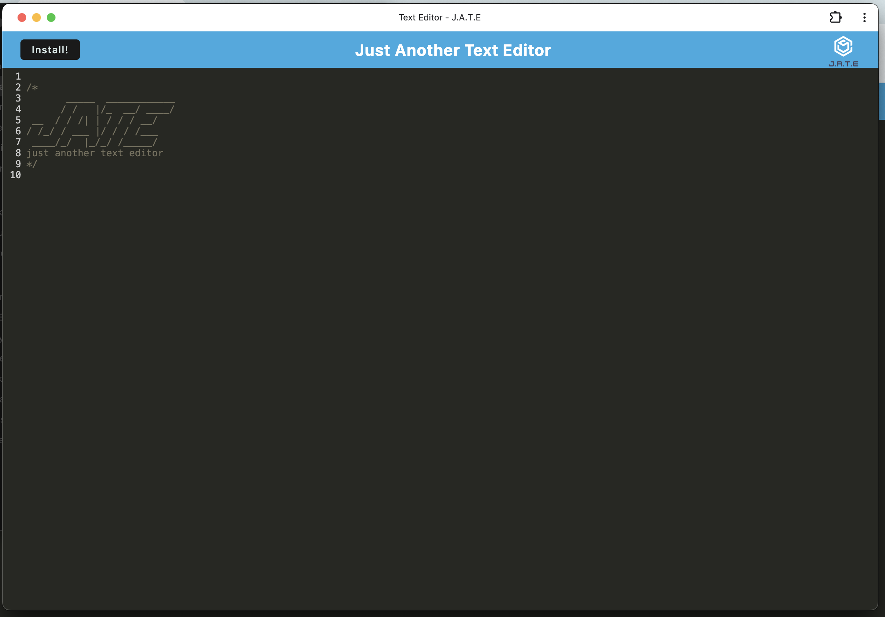

# Text Editor Starter Code
- Github repo link: https://github.com/danielleboe/text-editor-app
- Live application: https://text-editor-app-79yp.onrender.com/

## Description
A progressive web application text editor application

### User Story
- AS A developer
- I WANT to create notes or code snippets with or without an internet connection
- SO THAT I can reliably retrieve them for later use

### Acceptance Criteria
- GIVEN a text editor web application
- WHEN I open my application in my editor
- THEN I should see a client server folder structure
- WHEN I run `npm run start` from the root directory
- THEN I find that my application should start up the backend and serve the client
- WHEN I run the text editor application from my terminal
- THEN I find that my JavaScript files have been bundled using webpack
- WHEN I run my webpack plugins
- THEN I find that I have a generated HTML file, service worker, and a manifest file
- WHEN I use next-gen JavaScript in my application
- THEN I find that the text editor still functions in the browser without errors
- WHEN I open the text editor
- THEN I find that IndexedDB has immediately created a database storage
- WHEN I enter content and subsequently click off of the DOM window
- THEN I find that the content in the text editor has been saved with IndexedDB
- WHEN I reopen the text editor after closing it
- THEN I find that the content in the text editor has been retrieved from our IndexedDB
- WHEN I click on the Install button
- THEN I download my web application as an icon on my desktop
- WHEN I load my web application
- THEN I should have a registered service worker using workbox
- WHEN I register a service worker
- THEN I should have my static assets pre cached upon loading along with subsequent pages and static assets
- WHEN I deploy to Render
- THEN I should have proper build scripts for a webpack application

## Demo Video & Screen Shots
Demo Video
<video controls src="client/src/images/J.A.T.E.mp4" title="Title"></video>

## Author
Danielle Boenisch
Github: https://github.com/danielleboe
Email: danielleboenisch@gmail.com

## License
MIT License
